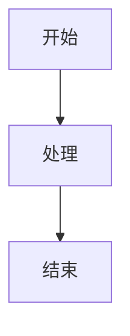

# 贡献文档指南

感谢您对 LLM-Workshop 文档的贡献！本指南将帮助您快速上手文档编写。

## 当前状态

文档站点的基础架构已经建立，包括：

✅ 完成的章节:
- 首页和导航结构
- Chapter 3: 检索与知识工程（完整）
  - Lesson 10: RAG 系统
  - Lesson 11: 知识图谱
  - Lesson 12: NL2SQL
- Chapter 4: 上下文工程（首页）
- 文档开发指南

🚧 待完善的章节:
- Chapter 1: 对话智能系统
- Chapter 2: 高级推理
- Chapter 4: 上下文工程（各 lesson）
- Chapter 5: 多模态模型
- Chapter 6: 多智能体编排
- Chapter 7: 微调数据构建
- Chapter 8: 微调基础

## 如何贡献

### 1. 选择要编写的章节

查看上面的待完善列表，选择一个您熟悉的章节。

### 2. 参考现有文档

最好的学习方式是参考已完成的文档：

- **章节首页示例**: `docs_site/docs/chapter3/index.md`
- **课程页面示例**: `docs_site/docs/chapter3/lesson1.md`
- **开发指南**: `docs_site/docs/docs-development.md`

### 3. 创建文档文件

```bash
# 创建章节目录
mkdir -p docs_site/docs/chapterX

# 创建章节首页
touch docs_site/docs/chapterX/index.md

# 创建课程页面
touch docs_site/docs/chapterX/lessonX.md
```

### 4. 编写文档内容

#### 章节首页模板 (`index.md`)

```yaml
---
layout: default
title: 章节标题
nav_order: X  # 按章节顺序: 2-9
has_children: true
description: "章节简短描述"
---

# 章节标题
{: .no_toc }

章节介绍（1-2 句话）
{: .fs-6 .fw-300 }

## 目录
{: .no_toc .text-delta }

1. TOC
{:toc}

---

## 章节概览

[详细介绍章节内容]

## 核心技术

[列出关键技术和工具]

## 学习路径

[建议的学习顺序]

...
```

#### 课程页面模板 (`lessonX.md`)

```yaml
---
layout: default
title: Lesson X - 课程名称
parent: 章节标题  # 必须与父页面的 title 一致
nav_order: X  # 课程顺序
description: "课程简短描述"
---

# Lesson X: 课程名称
{: .no_toc }

课程简介（1-2 句话）
{: .fs-6 .fw-300 }

## 目录
{: .no_toc .text-delta }

1. TOC
{:toc}

---

## 课程信息

> **模块**: Chapter X - 章节名称  
> **前置要求**: 需要的前置知识  
> **时长**: 预计学习时间  
> **难度**: 初级/中级/高级

---

## 核心概念

[介绍课程的核心概念]

## 实现细节

[详细的实现说明，包含代码示例]

## 快速开始

[环境准备和运行步骤]

...
```

### 5. 参考项目 README

每个课程的目录下通常有 README.md，包含详细的技术文档。可以参考这些内容编写文档：

```bash
# 例如，参考现有的 README
cat chapter1/lesson1/README.md
cat chapter6/lesson1/README.md
```

### 6. 使用文档特性

#### 标注框

```markdown
{: .note }
> 这是一个提示框

{: .warning }
> 这是一个警告框

{: .important }
> 这是一个重要信息框
```

#### 代码块

````markdown
```python
def example():
    print("示例代码")
```
````

#### Mermaid 图表

````markdown

````

#### 按钮和标签

```markdown
[按钮文本](链接){: .btn .btn-primary }

标签文本
{: .label .label-blue }
```

### 7. 本地预览

```bash
cd docs_site
bundle install
bundle exec jekyll serve

# 访问 http://localhost:4000/LLM-Workshop
```

### 8. 提交贡献

```bash
git add docs_site/
git commit -m "docs: 添加 Chapter X Lesson X 文档"
git push origin your-branch-name
```

然后创建 Pull Request。

## 文档编写规范

### 内容质量

1. **准确性**: 确保技术细节正确
2. **完整性**: 包含必要的背景知识和示例
3. **清晰性**: 使用简洁明了的语言
4. **实用性**: 提供可运行的代码示例

### 格式规范

1. **标题**: 使用清晰的层级结构
2. **代码**: 添加语言标识和注释
3. **图表**: 使用 Mermaid 绘制架构图
4. **链接**: 使用 `{{ site.baseurl }}` 前缀

### 风格指南

1. **语言**: 使用中文，专业术语保留英文
2. **语气**: 专业、友好、鼓励
3. **示例**: 提供真实、可运行的代码
4. **引用**: 标注论文和资源来源

## 参考资源

- [Jekyll 文档](https://jekyllrb.com/docs/)
- [just-the-docs 主题](https://just-the-docs.github.io/just-the-docs/)
- [Markdown 指南](https://www.markdownguide.org/)
- [Mermaid 文档](https://mermaid.js.org/)

## 需要帮助？

- 查看已完成的文档示例
- 阅读 `docs_site/docs/docs-development.md`
- 在 GitHub 创建 Issue 提问

## 文档优先级

建议按以下优先级完善文档：

### 高优先级
1. Chapter 6: 多智能体编排（热门话题）
2. Chapter 1: 对话智能系统（基础入门）
3. Chapter 4: 上下文工程各 lesson（技术深度）

### 中优先级
4. Chapter 7: 微调数据构建（实用工具）
5. Chapter 5: 多模态模型（前沿应用）
6. Chapter 2: 高级推理（进阶内容）

### 低优先级
7. Chapter 8: 微调基础（进阶主题）

## 模板文件

为方便贡献者，我们提供了模板文件：

```bash
# 复制模板
cp docs_site/docs/chapter3/index.md docs_site/docs/chapterX/index.md
cp docs_site/docs/chapter3/lesson1.md docs_site/docs/chapterX/lessonX.md

# 然后修改内容
```

---

感谢您的贡献！让我们一起打造高质量的 LLM 开发文档！

