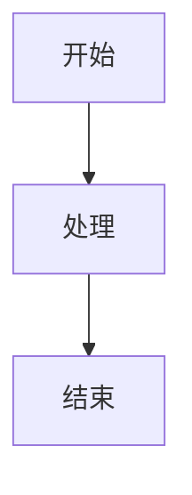

# 文档网站

这是使用 [just-the-docs](https://github.com/just-the-docs/just-the-docs) Jekyll 主题构建的 GitHub Pages 文档网站。

## 本地开发

### 前置要求

- Ruby 3.1+
- Bundler

### 安装依赖

```bash
cd docs_site
bundle install
```

### 本地运行

```bash
bundle exec jekyll serve
```

然后在浏览器中访问 [http://localhost:4000/LLM-Workshop](http://localhost:4000/LLM-Workshop)

## 部署

网站会自动通过 GitHub Actions 部署到 GitHub Pages。当你推送更改到 `main` 分支的 `docs_site/` 目录时，会自动触发构建和部署。

## 配置

主要配置文件：
- `_config.yml`: Jekyll 和主题配置
- `Gemfile`: Ruby 依赖管理

## 文档结构

```
docs_site/
├── index.md                          # 首页
├── docs/                             # 文档页面目录
│   ├── chapter1/                     # 对话智能系统
│   │   ├── index.md
│   │   ├── lesson1.md                # 智能体架构
│   │   ├── lesson2.md                # 数学推理
│   │   ├── lesson3.md                # 多模态对话
│   │   ├── lesson4.md                # 工具增强
│   │   └── lesson5.md                # 上下文学习
│   ├── chapter2/                     # 高级推理
│   │   ├── index.md
│   │   ├── lesson6.md                # 思维链
│   │   ├── lesson7.md                # 零样本推理
│   │   └── lesson9.md                # 思维树
│   ├── chapter3/                     # 检索与知识工程
│   │   ├── index.md
│   │   ├── lesson10.md               # RAG 系统
│   │   ├── lesson11.md               # 知识图谱
│   │   └── lesson12.md               # NL2SQL
│   ├── chapter4/                     # 上下文工程
│   │   ├── index.md
│   │   ├── lesson1.md                # KV-Cache 优化
│   │   ├── lesson2.md                # 工具遮蔽策略
│   │   ├── lesson3.md                # 文件系统内存
│   │   ├── lesson4.md                # 注意力复述
│   │   └── lesson5.md                # 错误保留
│   ├── chapter5/                     # 多模态模型
│   │   ├── index.md
│   │   ├── lesson1.md                # 图像内容分析
│   │   └── lesson2.md                # 文档处理
│   ├── chapter6/                     # 多智能体编排
│   │   ├── index.md
│   │   ├── lesson1.md                # 手动函数调用
│   │   ├── lesson2.md                # AutoGen 函数调用
│   │   ├── lesson3.md                # 代码解释器
│   │   ├── lesson4.md                # 反思系统
│   │   └── lesson5.md                # MemGPT 集成
│   ├── chapter7/                     # 微调数据构建
│   │   ├── index.md
│   │   ├── lesson1.md                # Few-shot 数据
│   │   ├── lesson2.md                # Self-Instruct
│   │   ├── lesson3.md                # Alpaca 格式
│   │   └── lesson5.md                # RLHF 偏好数据
│   ├── chapter8/                     # 微调基础
│   │   ├── index.md
│   │   └── lesson1.md                # GPT-1 风格微调
│   └── docs-development.md           # 文档开发指南
├── assets/
│   └── css/
│       └── custom.scss               # 自定义样式
├── _includes/
│   └── head_custom.html              # 自定义 head
├── _config.yml                        # Jekyll 配置
├── Gemfile                            # Ruby 依赖
└── README.md                          # 本文件
```

## 添加新文档

1. 在相应的 `docs/chapterX/` 目录下创建新的 Markdown 文件
2. 添加 YAML front matter：

```yaml
---
layout: default
title: 页面标题
parent: 父页面标题
nav_order: 排序号
description: "页面描述"
---
```

3. 编写文档内容（支持 Markdown 和 Liquid 模板语法）

## 样式定制

自定义样式在 `assets/css/custom.scss` 中定义。

## Mermaid 图表支持

文档支持 Mermaid 图表，使用方式：

````markdown

````

## 文档编写最佳实践

1. **使用清晰的标题层级**: 保持标题层级的逻辑性
2. **添加代码示例**: 使用代码块展示关键代码
3. **使用标注框**: 利用 `{: .note }`, `{: .warning }` 等标注重要信息
4. **添加内部链接**: 使用 `{{ site.baseurl }}/docs/path` 创建链接
5. **保持一致性**: 遵循现有文档的风格和结构

## 常见问题

### 本地预览时样式不正确？

确保你访问的是 `http://localhost:4000/LLM-Workshop` 而不是 `http://localhost:4000`，因为 baseurl 设置为 `/LLM-Workshop`。

### 如何测试 GitHub Pages 部署？

在推送前，使用以下命令测试构建：

```bash
bundle exec jekyll build
```

检查 `_site` 目录中的生成文件。

## 技术栈

- **Jekyll**: 静态站点生成器
- **just-the-docs**: 文档主题
- **GitHub Pages**: 托管平台
- **Mermaid**: 图表渲染

