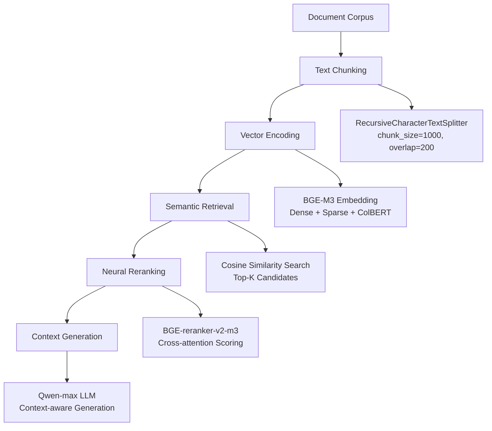
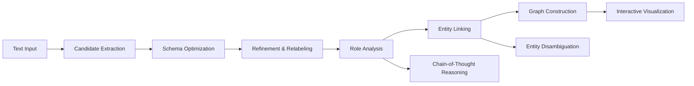

# Retrieval & Knowledge Engineering
{: .no_toc }

Build enterprise-grade retrieval-augmented generation systems, automated knowledge graph construction, and intelligent database query systems. Master the complete technology stack from information retrieval to knowledge engineering.
{: .fs-6 .fw-300 }

## Table of Contents
{: .no_toc .text-delta }

1. TOC
{:toc}

---

## Chapter Overview

This chapter delves into information retrieval and knowledge engineering technologies in the era of large language models, covering three core areas:

🔍 **Production-Grade RAG Systems**
{: .label .label-blue }
BGE-M3 multi-granular embeddings, neural reranking, context-enhanced generation
{: .fs-3 }

🕸️ **Knowledge Graph Construction**
{: .label .label-green }
Entity-relation extraction, chain-of-thought reasoning, automated schema optimization, interactive visualization
{: .fs-3 }

💾 **Enterprise-Grade NL2SQL**
{: .label .label-purple }
Natural language to SQL conversion, intelligent rejection mechanisms, business BI applications
{: .fs-3 }

---

## Core Technology Stack

| Technology Area | Core Technologies |
|:---------|:------------|
| **Vector Retrieval** | BGE-M3, BGE-reranker-v2-m3, FAISS |
| **Text Processing** | LangChain, RecursiveCharacterTextSplitter |
| **Knowledge Graphs** | NetworkX, Pyvis, Entity Linking Algorithms |
| **Reasoning Enhancement** | Chain-of-Thought, Context Engineering |
| **Database** | SQLite, Enterprise BI Simulation Environment |
| **Model Services** | DashScope (Qwen), OpenAI API |

---

## Learning Path

### Beginner Path: RAG Fundamentals
1. Complete Lesson 1: Understand RAG system architecture
2. Practice document chunking and vector embeddings
3. Master retrieval and reranking mechanisms

### Intermediate Path: Knowledge Engineering
1. Complete Lesson 2: Learn entity-relation extraction
2. Practice knowledge graph construction workflow
3. Master graph visualization techniques

### Advanced Path: Intelligent Querying
1. Complete Lesson 3: Learn NL2SQL implementation
2. Practice business scenario adaptation
3. Master query optimization and security control

---

## System Architecture

### RAG System Architecture



### Knowledge Graph Construction Flow



---

## Core Concepts

### 1. Retrieval-Augmented Generation (RAG)

**Core Idea**: Combine external knowledge bases with large language models to provide factually accurate, traceable answers.

**Key Components**:
- **Document Processing**: Intelligent text chunking, maintaining semantic integrity
- **Vector Retrieval**: Multi-granular embedding representations, improving recall
- **Neural Reranking**: Cross-attention mechanisms, optimizing ranking precision
- **Context Generation**: Generate answers based on retrieved documents

### 2. Knowledge Graphs

**Core Idea**: Convert unstructured text into structured knowledge representations, supporting complex reasoning and queries.

**Key Technologies**:
- **Entity Recognition**: Identify key entities in text
- **Relation Extraction**: Extract semantic relationships between entities
- **Schema Optimization**: Automated ontology design and normalization
- **Entity Linking**: Disambiguation and merging of synonymous entities

### 3. Natural Language to SQL

**Core Idea**: Convert natural language questions into structured database queries, lowering the barrier to data access.

**Key Capabilities**:
- **Intent Understanding**: Accurately identify query intent
- **Schema Mapping**: Map natural language to database schemas
- **SQL Generation**: Generate syntactically correct and semantically accurate SQL
- **Security Control**: Prevent SQL injection and unauthorized access

---

## Technical Highlights

### BGE-M3 Multi-Granular Embeddings

**Three Representation Methods**:
1. **Dense Vector**: Dense vector representation, suitable for semantic similarity
2. **Sparse Vector**: Sparse vector representation, preserving lexical features
3. **ColBERT**: Multi-vector representation, balancing precision and efficiency

**Advantages**:
- Cross-lingual semantic understanding
- Fusion of multiple retrieval strategies
- Production-validated performance

### Chain-of-Thought Reasoning

**Application Scenarios**:
- Complex entity-relation reasoning
- Multi-step knowledge extraction
- Ambiguity resolution decisions

**Implementation**:
```python
# Chain-of-thought prompt example
prompt = """
Let's analyze this document step by step:
1. First identify all possible entities
2. Then analyze their relationships
3. Finally determine attributes of each entity

Document content: {text}
"""
```

---

## Performance Metrics

### RAG System Metrics

| Metric | Target Value | Description |
|:-----|:-------|:-----|
| Retrieval Precision (P@5) | >85% | Top-5 result relevance |
| Reranking Improvement | +10-15% | Improvement over original retrieval |
| End-to-End Latency | <3s | Query to result generation |
| Vector Dimension | 1024 | BGE-M3 standard dimension |

### Knowledge Graph Metrics

| Metric | Target Value | Description |
|:-----|:-------|:-----|
| Entity Recognition F1 | >90% | Entity recognition accuracy |
| Relation Extraction Precision | >85% | Relation triple accuracy |
| Entity Linking Accuracy | >80% | Entity disambiguation correctness |
| Construction Time | <5min | Single document processing time |

---

## Best Practices

### Document Chunking Strategy

```python
from langchain.text_splitter import RecursiveCharacterTextSplitter

# Recommended configuration
splitter = RecursiveCharacterTextSplitter(
    chunk_size=1000,        # Chunk size
    chunk_overlap=200,       # Overlap region
    separators=["\n\n", "\n", ".", ",", " "],  # Separator priority
    length_function=len
)
```

### Retrieval Parameter Tuning

- **Top-K**: Initial retrieval recommended 20-50
- **Reranking Top-N**: Fine-ranking recommended 3-5
- **Similarity Threshold**: Adjust based on business scenarios
- **Batch Size**: Balance memory and speed

### Knowledge Graph Optimization

- **Entity Normalization**: Unified naming conventions
- **Relation Type Control**: Limit number of relation types
- **Attribute Filtering**: Retain core attributes
- **Graph Pruning**: Remove low-confidence nodes

---

## Common Questions

### RAG Systems

**Q: What if retrieval results are irrelevant?**

A: Check the following aspects:
1. Whether document chunking is reasonable
2. Whether queries need rewriting
3. Whether Top-K needs adjustment
4. Consider using query expansion

**Q: Generated answers contain hallucinations?**

A: Improvement directions:
1. Increase context constraints
2. Use stricter prompts
3. Enable citation mechanisms
4. Lower model temperature parameter

### Knowledge Graphs

**Q: Low entity recognition accuracy?**

A: Optimization strategies:
1. Use better entity recognition prompts
2. Add domain examples
3. Enable chain-of-thought reasoning
4. Post-processing rule supplementation

**Q: Too much noise in relation extraction?**

A: Solutions:
1. Limit relation types
2. Increase confidence thresholds
3. Use relation templates
4. Manual review feedback

---

## Practical Projects

### Project 1: Enterprise Document Q&A System

**Features**:
- Upload internal enterprise documents
- Intelligent semantic retrieval
- Accurate answer generation
- Traceable sources

**Tech Stack**: RAG + BGE-M3 + Qwen

### Project 2: Industry Knowledge Graph

**Features**:
- Automated entity-relation extraction
- Knowledge graph visualization
- Graph query interface
- Continuous update mechanism

**Tech Stack**: LLM + NetworkX + Pyvis

### Project 3: BI Intelligent Assistant

**Features**:
- Natural language data queries
- Automatic SQL generation
- Result visualization
- Query history management

**Tech Stack**: NL2SQL + SQLite + Gradio

---

## Extended Reading

### Academic Papers

- [RAG: Retrieval-Augmented Generation (Lewis et al., 2020)](https://arxiv.org/abs/2005.11401)
- [GraphRAG (Edge et al., 2024)](https://arxiv.org/abs/2404.16130)
- [BGE M3-Embedding (Chen et al., 2024)](https://arxiv.org/abs/2402.03216)
- [RAG vs Fine-tuning (Ovadia et al., 2024)](https://arxiv.org/abs/2401.08406)

### Technical Blogs

- [LangChain Document Processing Best Practices](https://python.langchain.com/docs/modules/data_connection/)
- [FAISS Vector Retrieval Guide](https://github.com/facebookresearch/faiss/wiki)
- [Knowledge Graph Construction Tool Comparison](https://github.com/topics/knowledge-graph)

---

## Next Steps

After completing this chapter, we recommend:

1. **Practical Projects**: Choose a practical project for deep implementation
2. **Performance Optimization**: Optimize for specific scenarios
3. **Continue Learning**: Proceed to Chapter 4 to learn Context Engineering
4. **Community Exchange**: Share experiences in GitHub discussions

{: .note }
> 💡 **Tip**: The technologies in this chapter are widely used in enterprise applications. We recommend learning and practicing in combination with actual business scenarios.
