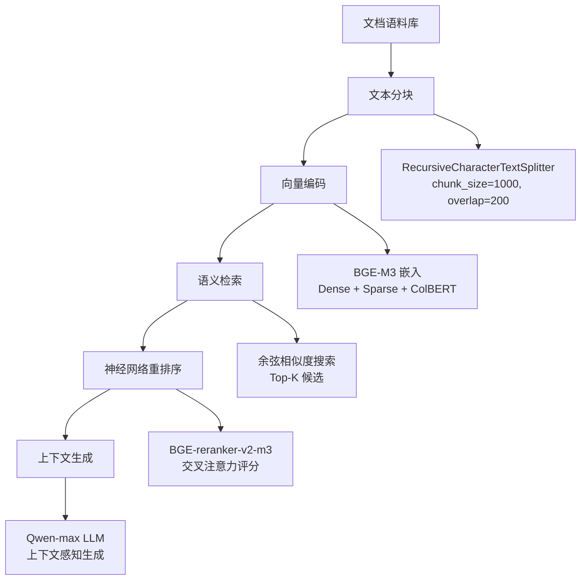
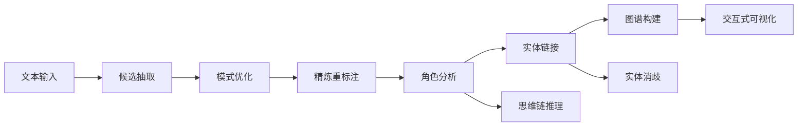

# Retrieval & Knowledge Engineering
{: .no_toc }

构建企业级检索增强生成系统、自动化知识图谱构建和智能数据库查询系统，掌握从信息检索到知识工程的完整技术栈。
{: .fs-6 .fw-300 }

## 目录
{: .no_toc .text-delta }

1. TOC
{:toc}

---

## 章节概览

本章深入探讨大语言模型时代的信息检索与知识工程技术，涵盖三个核心领域：

🔍 **生产级 RAG 系统**
{: .label .label-blue }
BGE-M3 多粒度嵌入、神经网络重排序、上下文增强生成
{: .fs-3 }

🕸️ **知识图谱构建**
{: .label .label-green }
实体关系抽取、思维链推理、自动化模式优化、交互式可视化
{: .fs-3 }

💾 **企业级 NL2SQL**
{: .label .label-purple }
自然语言到 SQL 转换、智能拒答机制、业务 BI 应用
{: .fs-3 }

---

## 核心技术栈

| 技术领域 | 核心技术 |
|:---------|:------------|
| **向量检索** | BGE-M3, BGE-reranker-v2-m3, FAISS |
| **文本处理** | LangChain, RecursiveCharacterTextSplitter |
| **知识图谱** | NetworkX, Pyvis, 实体链接算法 |
| **推理增强** | Chain-of-Thought, 上下文工程 |
| **数据库** | SQLite, 企业 BI 模拟环境 |
| **模型服务** | DashScope (Qwen), OpenAI API |

---

## 学习路径

### 初级路径：RAG 基础
1. 完成 Lesson 1: 了解 RAG 系统架构
2. 实践文档分块和向量嵌入
3. 掌握检索和重排序机制

### 中级路径：知识工程
1. 完成 Lesson 2: 学习实体关系抽取
2. 实践知识图谱构建流程
3. 掌握图可视化技术

### 高级路径：智能查询
1. 完成 Lesson 3: 学习 NL2SQL 实现
2. 实践业务场景适配
3. 掌握查询优化和安全控制

---

## 系统架构

### RAG 系统架构



### 知识图谱构建流程



---

## 核心概念

### 1. 检索增强生成 (RAG)

**核心思想**: 结合外部知识库和大语言模型，提供事实准确、可追溯来源的答案。

**关键组件**:
- **文档处理**: 智能文本分块，保持语义完整性
- **向量检索**: 多粒度嵌入表示，提高召回率
- **神经重排序**: 交叉注意力机制，优化排序精度
- **上下文生成**: 基于检索文档生成答案

### 2. 知识图谱

**核心思想**: 将非结构化文本转换为结构化知识表示，支持复杂推理和查询。

**关键技术**:
- **实体识别**: 识别文本中的关键实体
- **关系抽取**: 抽取实体间的语义关系
- **模式优化**: 自动化本体设计和规范化
- **实体链接**: 消歧和合并同义实体

### 3. 自然语言转 SQL

**核心思想**: 将自然语言问题转换为结构化数据库查询，降低数据访问门槛。

**关键能力**:
- **意图理解**: 准确识别查询意图
- **模式映射**: 将自然语言映射到数据库模式
- **SQL 生成**: 生成语法正确、语义准确的 SQL
- **安全控制**: 防止 SQL 注入和越权访问

---

## 技术亮点

### BGE-M3 多粒度嵌入

**三种表示方式**:
1. **Dense Vector**: 密集向量表示，适合语义相似度
2. **Sparse Vector**: 稀疏向量表示，保留词汇特征
3. **ColBERT**: 多向量表示，平衡精度和效率

**优势**:
- 跨语言语义理解
- 多种检索策略融合
- 生产环境验证的性能

### 思维链推理

**应用场景**:
- 复杂实体关系推理
- 多步骤知识抽取
- 歧义消解决策

**实现方式**:
```python
# 思维链 prompt 示例
prompt = """
让我们逐步分析这个文档：
1. 首先识别所有可能的实体
2. 然后分析它们之间的关系
3. 最后确定每个实体的属性

文档内容: {text}
"""
```

---

## 性能指标

### RAG 系统指标

| 指标 | 目标值 | 说明 |
|:-----|:-------|:-----|
| 检索精度 (P@5) | >85% | Top-5 结果相关性 |
| 重排序提升 | +10-15% | 相比原始检索的提升 |
| 端到端延迟 | <3s | 从查询到生成结果 |
| 向量维度 | 1024 | BGE-M3 标准维度 |

### 知识图谱指标

| 指标 | 目标值 | 说明 |
|:-----|:-------|:-----|
| 实体识别 F1 | >90% | 实体识别准确率 |
| 关系抽取精度 | >85% | 关系三元组准确率 |
| 实体链接准确率 | >80% | 实体消歧正确率 |
| 构建时间 | <5min | 单文档处理时间 |

---

## 最佳实践

### 文档分块策略

```python
from langchain.text_splitter import RecursiveCharacterTextSplitter

# 推荐配置
splitter = RecursiveCharacterTextSplitter(
    chunk_size=1000,        # 每块大小
    chunk_overlap=200,       # 重叠区域
    separators=["\n\n", "\n", "。", "，", " "],  # 分隔符优先级
    length_function=len
)
```

### 检索参数调优

- **Top-K**: 初始检索建议 20-50
- **重排序 Top-N**: 精排建议 3-5
- **相似度阈值**: 根据业务场景调整
- **批量大小**: 平衡内存和速度

### 知识图谱优化

- **实体规范化**: 统一命名规范
- **关系类型控制**: 限制关系类型数量
- **属性筛选**: 保留核心属性
- **图谱剪枝**: 移除低置信度节点

---

## 常见问题

### RAG 系统

**Q: 检索结果不相关怎么办？**

A: 检查以下方面：
1. 文档分块是否合理
2. 查询是否需要改写
3. 是否需要调整 Top-K
4. 考虑使用查询扩展

**Q: 生成答案出现幻觉？**

A: 改进方向：
1. 增加上下文约束
2. 使用更严格的 prompt
3. 启用引用机制
4. 降低模型温度参数

### 知识图谱

**Q: 实体识别准确率低？**

A: 优化策略：
1. 使用更好的实体识别 prompt
2. 增加领域示例
3. 启用思维链推理
4. 后处理规则补充

**Q: 关系抽取噪声多？**

A: 解决方案：
1. 限制关系类型
2. 增加置信度阈值
3. 使用关系模板
4. 人工审核反馈

---

## 实战项目

### 项目 1: 企业文档问答系统

**功能**:
- 上传企业内部文档
- 智能语义检索
- 准确答案生成
- 来源可追溯

**技术栈**: RAG + BGE-M3 + Qwen

### 项目 2: 行业知识图谱

**功能**:
- 自动化实体关系抽取
- 知识图谱可视化
- 图谱查询接口
- 持续更新机制

**技术栈**: LLM + NetworkX + Pyvis

### 项目 3: BI 智能助手

**功能**:
- 自然语言查询数据
- 自动生成 SQL
- 结果可视化
- 查询历史管理

**技术栈**: NL2SQL + SQLite + Gradio

---

## 扩展阅读

### 学术论文

- [RAG: Retrieval-Augmented Generation (Lewis et al., 2020)](https://arxiv.org/abs/2005.11401)
- [GraphRAG (Edge et al., 2024)](https://arxiv.org/abs/2404.16130)
- [BGE M3-Embedding (Chen et al., 2024)](https://arxiv.org/abs/2402.03216)
- [RAG vs Fine-tuning (Ovadia et al., 2024)](https://arxiv.org/abs/2401.08406)

### 技术博客

- [LangChain 文档处理最佳实践](https://python.langchain.com/docs/modules/data_connection/)
- [FAISS 向量检索指南](https://github.com/facebookresearch/faiss/wiki)
- [知识图谱构建工具对比](https://github.com/topics/knowledge-graph)

---

## 下一步

完成本章学习后，建议：

1. **实践项目**: 选择一个实战项目深入实现
2. **性能优化**: 针对特定场景进行调优
3. **继续学习**: 进入 Chapter 4 学习上下文工程
4. **社区交流**: 在 GitHub 讨论区分享经验

{: .note }
> 💡 **提示**: 本章技术在企业级应用中广泛使用。建议结合实际业务场景进行学习和实践。

