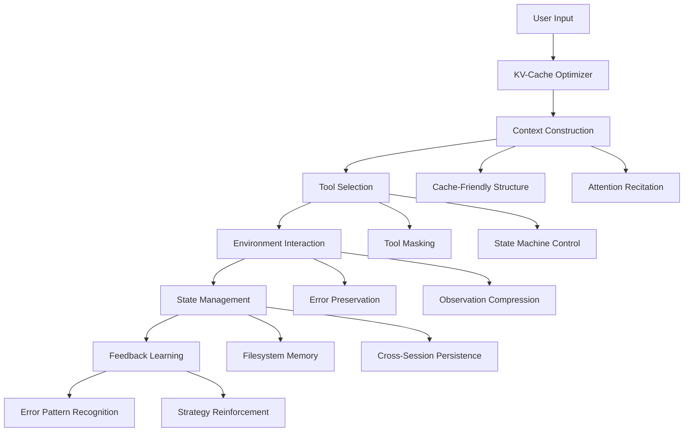

# Context Engineering
{: .no_toc }

Explore the art and science of context engineering for AI agents. Learn to build high-performance, reliable production-grade agent systems through carefully designed context management strategies.
{: .fs-6 .fw-300 }

## Table of Contents
{: .no_toc .text-delta }

1. TOC
{:toc}

---

## Chapter Overview

> "If model progress is a rising tide, we want agents to be ships, not pillars fixed to the seabed."

This chapter explores the core concepts and best practices of context engineering, derived from practical exploration in iterative agent framework development.

### Core Modules

⚡ **KV-Cache Optimization**
{: .label .label-blue }
Cache-friendly prompt design, 90% cost reduction
{: .fs-3 }

🎯 **Tool Masking Strategy**
{: .label .label-green }
"Mask rather than remove" principle, maintaining cache efficiency
{: .fs-3 }

💾 **Filesystem Memory**
{: .label .label-purple }
Unlimited capacity persistent external memory
{: .fs-3 }

🔍 **Attention Recitation**
{: .label .label-yellow }
Guide attention distribution through recitation
{: .fs-3 }

🛠️ **Error Preservation & Learning**
{: .label .label-red }
"Preserve error information", learn from failures
{: .fs-3 }

---

## Core Philosophy

### Why Choose Context Learning?

**Context-Learning-Based Agent Architecture** vs **End-to-End Training**:

| Dimension | Context Learning | End-to-End Training |
|:-----|:----------|:----------|
| **Iteration Speed** | ⚡ Fast | 🐌 Slow |
| **Adaptability** | 🎯 Strong | ❌ Weak |
| **Interpretability** | ✅ High | ❌ Low |
| **Maintenance Cost** | 💰 Low | 💸 High |
| **Model Dependency** | 🚢 Improves with model progress | 🏛️ Fixed at training time |

{: .note }
> Context learning allows agents to improve like ships with the progress of large models, rather than being fixed like pillars.

---

## Key Design Principles

### 1. Cache-First Principle

**Core Idea**: Keep prompt prefixes stable, use append-style context design.

```python
# ❌ Bad design - breaks cache
def dynamic_prompt(task):
    return f"Current time: {time.now()}\nTask: {task}\nTools: {get_tools()}"

# ✅ Good design - maintains cache
def cache_friendly_prompt(task):
    base = "You are a helpful assistant with the following tools:\n{tools_definition}"
    context = f"\n\n[New Task] {task}"
    return base + context  # Append rather than rebuild
```

**Benefit**: Cached token cost is only 1/10 of uncached

### 2. Mask Rather Than Remove

**Core Idea**: Keep all tool definitions in context, control availability through logits constraints.

```python
# ❌ Bad design - breaks cache
def get_available_tools(state):
    if state == "search":
        return [search_tool, finish_tool]
    elif state == "analyze":
        return [analyze_tool, finish_tool]

# ✅ Good design - tool masking
def mask_tools(state):
    all_tools = [search_tool, analyze_tool, finish_tool]  # Always present
    allowed = get_allowed_tools(state)  # Only control availability
    return apply_logits_mask(all_tools, allowed)
```

### 3. Externalized Memory

**Core Idea**: Filesystem as unlimited capacity persistent memory.

```python
# Memory management
class FilesystemMemory:
    def __init__(self, workspace: Path):
        self.workspace = workspace
    
    def save(self, key: str, content: str):
        """Save to filesystem"""
        (self.workspace / f"{key}.md").write_text(content)
    
    def load(self, key: str) -> str:
        """Load on demand"""
        return (self.workspace / f"{key}.md").read_text()
    
    def summarize(self, key: str) -> str:
        """Recoverable compression"""
        content = self.load(key)
        summary = llm.summarize(content)
        return f"[Summary of {key}]\n{summary}\n[Load full: cat {key}.md]"
```

### 4. Attention Guidance

**Core Idea**: Manipulate attention distribution through natural language recitation.

```python
# todo.md mechanism
TODO_TEMPLATE = """
# Current Tasks

## High Priority
- [ ] {main_goal}

## In Progress
- [x] {completed_task}
- [ ] {current_task} <-- YOU ARE HERE

## Next Steps
1. {next_step_1}
2. {next_step_2}
"""

# Recite goals in each conversation round
def build_context_with_attention(task, history):
    return f"""
{TODO_TEMPLATE}

Remember: Your main goal is {main_goal}
Current focus: {current_task}

{history}
"""
```

### 5. Errors as Resources

**Core Idea**: Preserve error information as learning material.

```python
class ErrorPreservingAgent:
    def __init__(self):
        self.error_history = []
    
    def execute(self, action):
        try:
            return action.run()
        except Exception as e:
            # Preserve error rather than hide
            error_record = {
                'action': action,
                'error': str(e),
                'context': self.get_context(),
                'timestamp': time.now()
            }
            self.error_history.append(error_record)
            
            # Learn from errors
            self.update_beliefs(error_record)
            
            # Graceful recovery
            return self.recover_from_error(error_record)
```

---

## System Architecture



---

## Performance Metrics

### System-Level Metrics

| Metric | Target Value | Description |
|:-----|:-------|:-----|
| **KV-Cache Hit Rate** | >80% | Cache efficiency |
| **Average Response Time** | <2s | End-to-end latency |
| **Cost Efficiency** | 60%+ reduction | Compared to baseline |

### Agent Behavior Metrics

| Metric | Description |
|:-----|:-----|
| **Task Completion Rate** | Success rate on complex multi-step tasks |
| **Goal Consistency** | Goal deviation in long-term tasks |
| **Error Recovery Rate** | Proportion of successful recoveries from failures |
| **Learning Adaptability** | Trend of reducing repeated errors |

---

## Learning Path

### Beginner Path (1-2 hours)
1. Lesson 1: KV-Cache Optimization
2. Lesson 2: Tool Masking Strategy
3. Complete basic performance optimization

### Intermediate Path (2-3 hours)
1. Lesson 3: Filesystem Memory
2. Lesson 4: Attention Recitation
3. Build persistent agents

### Advanced Path (3-5 hours)
1. Lesson 5: Error Preservation & Learning
2. Integrate all technologies
3. Build production-grade agents

---

## Experimental Features

### SSM-Agent Architecture

**State Space Model + Filesystem Memory**:

```python
class SSMAgent:
    """Agent based on state space model"""
    def __init__(self):
        self.state_model = StateSpaceModel()
        self.fs_memory = FilesystemMemory()
    
    def process(self, input_sequence):
        # Use SSM to efficiently process long sequences
        compressed_state = self.state_model.encode(input_sequence)
        
        # Detailed information stored in filesystem
        self.fs_memory.save("full_context", input_sequence)
        
        # Only keep compressed state in context
        return compressed_state
```

### Multimodal Context Engineering

```python
# Text-image mixed context optimization
def multimodal_context(text, images):
    # Encode images as text descriptions (cacheable)
    image_captions = [encode_image(img) for img in images]
    
    # Build cache-friendly structure
    context = f"""
## Text Content
{text}

## Visual Context
{'\n'.join(image_captions)}
"""
    return context
```

---

## Practical Projects

### Project: Production-Grade Task Agent

**Feature List**:
- ✅ Cache-optimized prompt structure
- ✅ State machine-driven tool control
- ✅ Filesystem persistent memory
- ✅ Automatic goal tracking and recitation
- ✅ Error learning and graceful recovery

**Architecture Example**:

```python
class ProductionAgent:
    def __init__(self):
        self.cache_manager = KVCacheManager()
        self.tool_masker = ToolMaskingSystem()
        self.memory = FilesystemMemory()
        self.attention = AttentionReciter()
        self.error_learner = FailureLearner()
    
    def run(self, task: str):
        # 1. Cache optimization
        context = self.cache_manager.build_context(task)
        
        # 2. Tool masking
        available_tools = self.tool_masker.get_masked_tools(self.state)
        
        # 3. Attention guidance
        recitation = self.attention.generate_recitation(task)
        
        # 4. Execution loop
        while not self.is_complete():
            action = self.select_action(context, available_tools, recitation)
            
            try:
                result = self.execute(action)
                self.memory.save(f"step_{self.step}", result)
            except Exception as e:
                # 5. Error learning
                recovery = self.error_learner.recover(e, self.get_context())
                result = recovery
        
        return self.get_final_result()
```

---

## Extended Reading

### Academic Papers

- [Attention Is All You Need](https://arxiv.org/abs/1706.03762) - Vaswani et al., 2017
- [Efficient Memory Management for Large Language Model Serving with PagedAttention](https://arxiv.org/abs/2309.06180) - Kwon et al., 2023
- [FlashAttention-2](https://arxiv.org/abs/2307.08691) - Dao, 2023

### Technical Blogs

- [KV-Cache Optimization Practices](https://lilianweng.github.io/posts/2023-01-27-kvcache/)
- [Agent Architecture Design Patterns](https://developer.nvidia.com/blog/agent-architecture-patterns/)

---

## Next Steps

After completing this chapter, you will master:

1. **Production-Grade Agent Design**: Build stable and reliable agent systems
2. **Performance Optimization Techniques**: Significantly improve agent efficiency and reduce costs
3. **Context Engineering Practices**: Fine-grained control of agent behavior and decision processes
4. **Error Handling Philosophy**: Mindset of turning failures into improvement opportunities
5. **System Architecture Thinking**: Design capability balancing functionality, performance, and maintainability

{: .note }
> 💡 **Important**: Context engineering is a rapidly evolving field. This chapter's content is based on current best practices. We recommend staying updated with the latest research.
