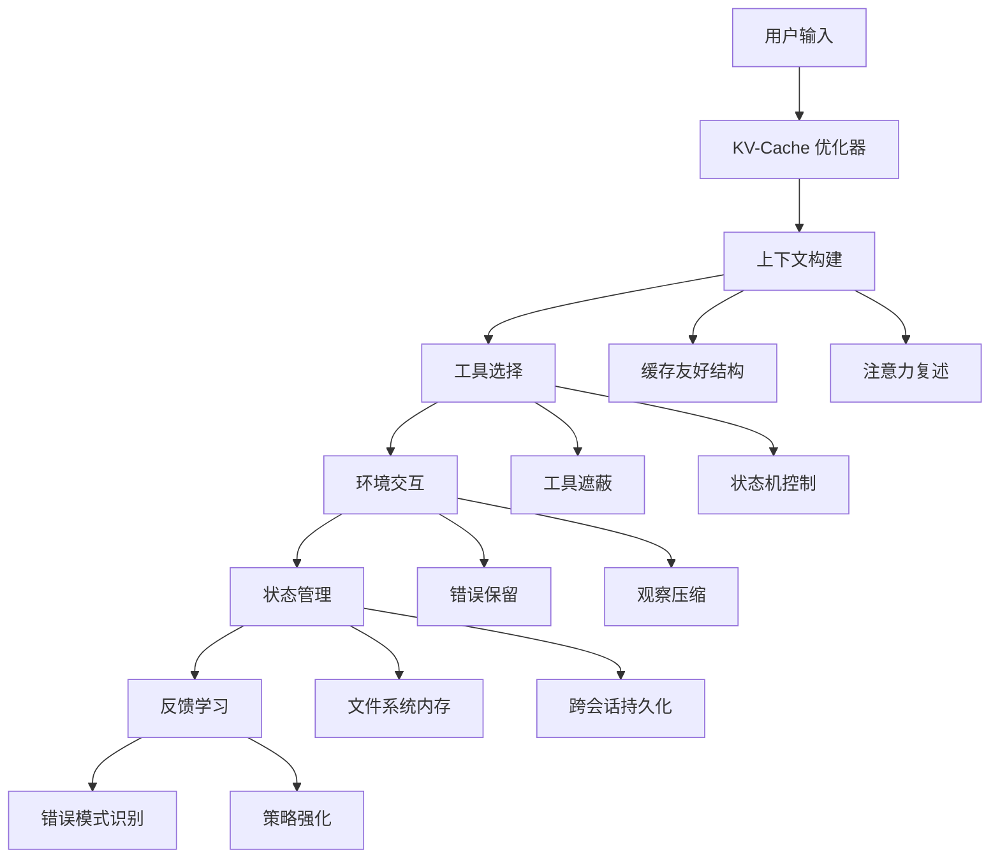

# Context Engineering
{: .no_toc }

探索 AI 智能体的上下文工程艺术与科学，学习通过精心设计的上下文管理策略构建高性能、可靠的生产级智能体系统。
{: .fs-6 .fw-300 }

## 目录
{: .no_toc .text-delta }

1. TOC
{:toc}

---

## 章节概览

> "如果模型进步是涨潮，我们希望智能体是船，而非钉在海床上的柱子。"

本章探讨上下文工程的核心理念和最佳实践，这些经验来自于迭代智能体框架开发中的实践探索。

### 核心模块

⚡ **KV-Cache 优化**
{: .label .label-blue }
缓存友好的 prompt 设计，成本降低 90%
{: .fs-3 }

🎯 **工具遮蔽策略**
{: .label .label-green }
"遮蔽而非移除"原则，保持缓存效率
{: .fs-3 }

💾 **文件系统内存**
{: .label .label-purple }
无限容量的持久化外部内存
{: .fs-3 }

🔍 **注意力复述**
{: .label .label-yellow }
通过复述引导注意力分布
{: .fs-3 }

🛠️ **错误保留学习**
{: .label .label-red }
"保留错误信息"，从失败中学习
{: .fs-3 }

---

## 核心哲学

### 为什么选择上下文学习？

**基于上下文学习的智能体架构** vs **端到端训练**:

| 维度 | 上下文学习 | 端到端训练 |
|:-----|:----------|:----------|
| **迭代速度** | ⚡ 快速 | 🐌 缓慢 |
| **适应性** | 🎯 强 | ❌ 弱 |
| **可解释性** | ✅ 高 | ❌ 低 |
| **维护成本** | 💰 低 | 💸 高 |
| **模型依赖** | 🚢 随模型进步而改进 | 🏛️ 固定在训练时状态 |

{: .note }
> 上下文学习让智能体像船一样随着大模型的进步而提升，而不是像柱子一样固定不变。

---

## 关键设计原则

### 1. 缓存优先原则

**核心思想**: 保持 prompt 前缀稳定，使用追加式上下文设计。

```python
# ❌ 不好的设计 - 破坏缓存
def dynamic_prompt(task):
    return f"Current time: {time.now()}\nTask: {task}\nTools: {get_tools()}"

# ✅ 好的设计 - 保持缓存
def cache_friendly_prompt(task):
    base = "You are a helpful assistant with the following tools:\n{tools_definition}"
    context = f"\n\n[New Task] {task}"
    return base + context  # 追加而非重建
```

**收益**: 缓存 token 成本仅为未缓存的 1/10

### 2. 遮蔽而非移除

**核心思想**: 保留所有工具定义在上下文中，通过 logits 约束控制可用性。

```python
# ❌ 不好的设计 - 破坏缓存
def get_available_tools(state):
    if state == "search":
        return [search_tool, finish_tool]
    elif state == "analyze":
        return [analyze_tool, finish_tool]

# ✅ 好的设计 - 工具遮蔽
def mask_tools(state):
    all_tools = [search_tool, analyze_tool, finish_tool]  # 始终存在
    allowed = get_allowed_tools(state)  # 只控制可用性
    return apply_logits_mask(all_tools, allowed)
```

### 3. 外部化内存

**核心思想**: 文件系统作为无限容量的持久化内存。

```python
# 记忆管理
class FilesystemMemory:
    def __init__(self, workspace: Path):
        self.workspace = workspace
    
    def save(self, key: str, content: str):
        """保存到文件系统"""
        (self.workspace / f"{key}.md").write_text(content)
    
    def load(self, key: str) -> str:
        """按需加载"""
        return (self.workspace / f"{key}.md").read_text()
    
    def summarize(self, key: str) -> str:
        """可恢复的压缩"""
        content = self.load(key)
        summary = llm.summarize(content)
        return f"[Summary of {key}]\n{summary}\n[Load full: cat {key}.md]"
```

### 4. 注意力引导

**核心思想**: 通过自然语言复述操纵注意力分布。

```python
# todo.md 机制
TODO_TEMPLATE = """
# Current Tasks

## High Priority
- [ ] {main_goal}

## In Progress
- [x] {completed_task}
- [ ] {current_task} <-- YOU ARE HERE

## Next Steps
1. {next_step_1}
2. {next_step_2}
"""

# 每轮对话都复述目标
def build_context_with_attention(task, history):
    return f"""
{TODO_TEMPLATE}

Remember: Your main goal is {main_goal}
Current focus: {current_task}

{history}
"""
```

### 5. 错误作为资源

**核心思想**: 保留错误信息作为学习材料。

```python
class ErrorPreservingAgent:
    def __init__(self):
        self.error_history = []
    
    def execute(self, action):
        try:
            return action.run()
        except Exception as e:
            # 保留错误而非隐藏
            error_record = {
                'action': action,
                'error': str(e),
                'context': self.get_context(),
                'timestamp': time.now()
            }
            self.error_history.append(error_record)
            
            # 从错误中学习
            self.update_beliefs(error_record)
            
            # 优雅恢复
            return self.recover_from_error(error_record)
```

---

## 系统架构



---

## 性能指标

### 系统级指标

| 指标 | 目标值 | 说明 |
|:-----|:-------|:-----|
| **KV-Cache 命中率** | >80% | 缓存效率 |
| **平均响应时间** | <2s | 端到端延迟 |
| **成本效率** | 60%+ 降低 | 相比基线 |

### 智能体行为指标

| 指标 | 说明 |
|:-----|:-----|
| **任务完成率** | 复杂多步骤任务成功率 |
| **目标一致性** | 长期任务中的目标偏离度 |
| **错误恢复率** | 从失败中成功恢复的比例 |
| **学习适应性** | 减少重复错误的趋势 |

---

## 学习路径

### 初级路径 (1-2 小时)
1. Lesson 1: KV-Cache 优化
2. Lesson 2: 工具遮蔽策略
3. 完成基础性能优化

### 中级路径 (2-3 小时)
1. Lesson 3: 文件系统内存
2. Lesson 4: 注意力复述
3. 构建持久化智能体

### 高级路径 (3-5 小时)
1. Lesson 5: 错误保留学习
2. 集成所有技术
3. 构建生产级智能体

---

## 实验特性

### SSM-Agent 架构

**状态空间模型 + 文件系统内存**:

```python
class SSMAgent:
    """基于状态空间模型的智能体"""
    def __init__(self):
        self.state_model = StateSpaceModel()
        self.fs_memory = FilesystemMemory()
    
    def process(self, input_sequence):
        # 使用 SSM 高效处理长序列
        compressed_state = self.state_model.encode(input_sequence)
        
        # 详细信息存储在文件系统
        self.fs_memory.save("full_context", input_sequence)
        
        # 只在上下文中保留压缩状态
        return compressed_state
```

### 多模态上下文工程

```python
# 图文混合上下文优化
def multimodal_context(text, images):
    # 图像编码为文本描述（可缓存）
    image_captions = [encode_image(img) for img in images]
    
    # 构建缓存友好的结构
    context = f"""
## Text Content
{text}

## Visual Context
{'\n'.join(image_captions)}
"""
    return context
```

---

## 实战项目

### 项目: 生产级任务智能体

**功能清单**:
- ✅ 缓存优化的 prompt 结构
- ✅ 状态机驱动的工具控制
- ✅ 文件系统持久化内存
- ✅ 自动目标跟踪和复述
- ✅ 错误学习和优雅恢复

**架构示例**:

```python
class ProductionAgent:
    def __init__(self):
        self.cache_manager = KVCacheManager()
        self.tool_masker = ToolMaskingSystem()
        self.memory = FilesystemMemory()
        self.attention = AttentionReciter()
        self.error_learner = FailureLearner()
    
    def run(self, task: str):
        # 1. 缓存优化
        context = self.cache_manager.build_context(task)
        
        # 2. 工具遮蔽
        available_tools = self.tool_masker.get_masked_tools(self.state)
        
        # 3. 注意力引导
        recitation = self.attention.generate_recitation(task)
        
        # 4. 执行循环
        while not self.is_complete():
            action = self.select_action(context, available_tools, recitation)
            
            try:
                result = self.execute(action)
                self.memory.save(f"step_{self.step}", result)
            except Exception as e:
                # 5. 错误学习
                recovery = self.error_learner.recover(e, self.get_context())
                result = recovery
        
        return self.get_final_result()
```

---

## 扩展阅读

### 学术论文

- [Attention Is All You Need](https://arxiv.org/abs/1706.03762) - Vaswani et al., 2017
- [Efficient Memory Management for Large Language Model Serving with PagedAttention](https://arxiv.org/abs/2309.06180) - Kwon et al., 2023
- [FlashAttention-2](https://arxiv.org/abs/2307.08691) - Dao, 2023

### 技术博客

- [KV-Cache 优化实践](https://lilianweng.github.io/posts/2023-01-27-kvcache/)
- [Agent 架构设计模式](https://developer.nvidia.com/blog/agent-architecture-patterns/)

---

## 下一步

完成本章学习后，你将掌握：

1. **生产级智能体设计**: 构建稳定可靠的智能体系统
2. **性能优化技术**: 显著提升智能体效率并降低成本
3. **上下文工程实践**: 精细控制智能体行为和决策过程
4. **错误处理哲学**: 将失败转化为改进机会的思维方式
5. **系统架构思维**: 平衡功能、性能和可维护性的设计能力

{: .note }
> 💡 **重要**: 上下文工程是快速演进的领域。本章内容基于当前最佳实践，建议持续关注最新研究成果。

